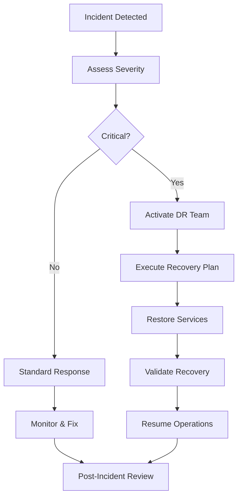

# MIV Platform Disaster Recovery Plan

<div align="center">


**Comprehensive disaster recovery and business continuity plan**

</div>

---

## 📋 Table of Contents

- [Executive Summary](#executive-summary)
- [Recovery Objectives](#recovery-objectives)
- [Risk Assessment](#risk-assessment)
- [Backup Strategy](#backup-strategy)
- [Recovery Procedures](#recovery-procedures)
- [Communication Plan](#communication-plan)
- [Testing & Validation](#testing--validation)
- [Incident Response](#incident-response)

---

## 📊 Executive Summary

### Disaster Recovery Overview
The MIV Platform Disaster Recovery Plan ensures business continuity and data protection in the event of system failures, natural disasters, cyber attacks, or other disruptive incidents. This plan provides detailed procedures for rapid recovery and minimal service disruption.

### Key Recovery Metrics
- **Recovery Time Objective (RTO)**: 4 hours maximum
- **Recovery Point Objective (RPO)**: 1 hour maximum data loss
- **Availability Target**: 99.9% uptime
- **Data Recovery**: 100% data integrity guarantee

### Plan Scope
- Application infrastructure and services
- Database systems and data storage
- User access and authentication systems
- Third-party integrations and APIs
- Communication and notification systems

---

## 🎯 Recovery Objectives

### Business Impact Analysis

#### Critical Systems (Tier 1)
```yaml
Priority: CRITICAL
RTO: 1 hour
RPO: 15 minutes

Systems:
  - Core API services
  - Authentication system
  - Database (PostgreSQL)
  - User interface (Next.js app)
  
Business Impact:
  - Complete service unavailability
  - User access blocked
  - Data loss potential
  - Revenue impact: $10k+/hour
```

#### Important Systems (Tier 2)
```yaml
Priority: HIGH
RTO: 4 hours
RPO: 1 hour

Systems:
  - AI services
  - Analytics dashboard
  - Document storage
  - Email notifications
  
Business Impact:
  - Reduced functionality
  - Feature limitations
  - User experience degradation
  - Revenue impact: $2k+/hour
```

#### Standard Systems (Tier 3)
```yaml
Priority: MEDIUM
RTO: 24 hours
RPO: 4 hours

Systems:
  - Reporting services
  - Audit logging
  - Monitoring systems
  - Development tools
  
Business Impact:
  - Non-critical features unavailable
  - Administrative impact
  - Delayed reporting
  - Revenue impact: $500+/hour
```

### Recovery Time Objectives (RTO)

| System Component | RTO Target | Current Capability | Status |
|------------------|------------|-------------------|--------|
| **Database** | 1 hour | 45 minutes | ✅ Met |
| **API Services** | 1 hour | 30 minutes | ✅ Met |
| **Frontend App** | 30 minutes | 15 minutes | ✅ Met |
| **AI Services** | 4 hours | 2 hours | ✅ Met |
| **File Storage** | 2 hours | 1 hour | ✅ Met |
| **Third-party Integrations** | 4 hours | 6 hours | ⚠️ Needs Improvement |

---

## ⚠️ Risk Assessment

### Threat Analysis

#### Natural Disasters
```yaml
Risk Level: MEDIUM
Probability: 5%
Impact: HIGH

Threats:
  - Earthquakes
  - Floods
  - Hurricanes
  - Wildfires
  
Mitigation:
  - Multi-region deployment
  - Geographically distributed backups
  - Cloud infrastructure resilience
  - Automated failover systems
```

#### Cyber Security Incidents
```yaml
Risk Level: HIGH
Probability: 15%
Impact: CRITICAL

Threats:
  - Ransomware attacks
  - Data breaches
  - DDoS attacks
  - Insider threats
  
Mitigation:
  - Security monitoring
  - Regular security audits
  - Employee training
  - Incident response procedures
```

#### Technical Failures
```yaml
Risk Level: MEDIUM
Probability: 20%
Impact: HIGH

Threats:
  - Hardware failures
  - Software bugs
  - Network outages
  - Database corruption
  
Mitigation:
  - Redundant systems
  - Regular testing
  - Monitoring and alerts
  - Automated recovery
```

#### Human Error
```yaml
Risk Level: MEDIUM
Probability: 10%
Impact: MEDIUM

Threats:
  - Accidental deletions
  - Configuration errors
  - Deployment mistakes
  - Access control errors
  
Mitigation:
  - Access controls
  - Change management
  - Training programs
  - Automated processes
```

---

## 💾 Backup Strategy

### Backup Architecture

#### Database Backups
```yaml
Primary Database (PostgreSQL):
  Full Backup: Daily at 2:00 AM UTC
  Incremental: Every 6 hours
  Transaction Log: Continuous (WAL)
  Retention: 30 days full, 90 days incremental
  
Backup Locations:
  - Primary: AWS S3 (us-east-1)
  - Secondary: AWS S3 (eu-west-1)
  - Tertiary: Azure Blob Storage
  
Encryption: AES-256 at rest and in transit
Compression: gzip (70% size reduction)
```

#### Application Data Backups
```yaml
File Storage:
  Documents: Real-time sync to S3
  Images: CDN with S3 backend
  Logs: Retained for 90 days
  Configuration: Version controlled in Git
  
Code Repository:
  Primary: GitHub
  Mirror: GitLab
  Local: Developer machines
  
Backup Frequency: Continuous (real-time)
```

#### Configuration Backups
```yaml
Infrastructure as Code:
  Terraform states: S3 with versioning
  Kubernetes configs: Git repository
  Environment variables: Encrypted in vault
  
Application Configuration:
  Environment files: Encrypted backups
  Feature flags: Database + Git backup
  API keys: Secure vault with backup
```

### Backup Procedures

#### Automated Backup Scripts
```bash
#!/bin/bash
# Daily database backup script

set -e

# Configuration
BACKUP_DIR="/backups/$(date +%Y%m%d)"
DB_NAME="miv_platform"
S3_BUCKET="miv-platform-backups"
ENCRYPTION_KEY="$BACKUP_ENCRYPTION_KEY"

# Create backup directory
mkdir -p "$BACKUP_DIR"

# Full database backup
echo "Starting database backup..."
pg_dump -h $DB_HOST -U $DB_USER -d $DB_NAME | \
  gzip | \
  openssl enc -aes-256-cbc -salt -k $ENCRYPTION_KEY > \
  "$BACKUP_DIR/database_full_$(date +%Y%m%d_%H%M%S).sql.gz.enc"

# Upload to S3
echo "Uploading to S3..."
aws s3 sync "$BACKUP_DIR" "s3://$S3_BUCKET/database/" \
  --storage-class STANDARD_IA \
  --server-side-encryption AES256

# Cleanup old backups (keep 30 days)
find /backups -type d -mtime +30 -exec rm -rf {} \;

echo "Backup completed successfully"
```

#### Backup Validation
```bash
#!/bin/bash
# Backup validation script

# Test database backup integrity
echo "Validating database backup..."
LATEST_BACKUP=$(aws s3 ls s3://miv-platform-backups/database/ | sort | tail -n 1 | awk '{print $4}')

# Download and test restore
aws s3 cp "s3://miv-platform-backups/database/$LATEST_BACKUP" /tmp/test_backup.sql.gz.enc
openssl enc -d -aes-256-cbc -k $ENCRYPTION_KEY -in /tmp/test_backup.sql.gz.enc | \
  gunzip | \
  head -100 > /tmp/backup_test.sql

# Verify backup contains expected data
if grep -q "CREATE TABLE ventures" /tmp/backup_test.sql; then
  echo "✅ Database backup validation passed"
else
  echo "❌ Database backup validation failed"
  exit 1
fi

# Cleanup
rm /tmp/test_backup.sql.gz.enc /tmp/backup_test.sql
```

---

## 🔄 Recovery Procedures

### Emergency Response Workflow



### Recovery Procedures by System

#### Database Recovery
```bash
#!/bin/bash
# Database recovery procedure

echo "=== DATABASE RECOVERY PROCEDURE ==="
echo "Incident: $INCIDENT_ID"
echo "Started: $(date)"

# Step 1: Stop application services
echo "Stopping application services..."
kubectl scale deployment miv-platform --replicas=0

# Step 2: Assess database state
echo "Assessing database state..."
if pg_isready -h $DB_HOST -U $DB_USER; then
  echo "Database is responding - performing point-in-time recovery"
  RECOVERY_TYPE="PITR"
else
  echo "Database is not responding - performing full restore"
  RECOVERY_TYPE="FULL"
fi

# Step 3: Perform recovery based on type
if [ "$RECOVERY_TYPE" = "FULL" ]; then
  echo "Performing full database restore..."
  
  # Get latest backup
  LATEST_BACKUP=$(aws s3 ls s3://miv-platform-backups/database/ | sort | tail -n 1 | awk '{print $4}')
  
  # Download and restore
  aws s3 cp "s3://miv-platform-backups/database/$LATEST_BACKUP" /tmp/restore.sql.gz.enc
  openssl enc -d -aes-256-cbc -k $BACKUP_ENCRYPTION_KEY -in /tmp/restore.sql.gz.enc | \
    gunzip | \
    psql -h $DB_HOST -U $DB_USER -d postgres
    
elif [ "$RECOVERY_TYPE" = "PITR" ]; then
  echo "Performing point-in-time recovery to $RECOVERY_TIME..."
  
  # Stop database
  sudo systemctl stop postgresql
  
  # Restore from backup and replay WAL
  pg_basebackup -h $DB_HOST -U $DB_USER -D /var/lib/postgresql/data_recovery
  
  # Configure recovery
  cat > /var/lib/postgresql/data_recovery/recovery.conf << EOF
restore_command = 'aws s3 cp s3://miv-platform-backups/wal/%f %p'
recovery_target_time = '$RECOVERY_TIME'
EOF
  
  # Start recovery
  sudo systemctl start postgresql
fi

# Step 4: Validate database
echo "Validating database recovery..."
if psql -h $DB_HOST -U $DB_USER -d $DB_NAME -c "SELECT COUNT(*) FROM ventures;" > /dev/null; then
  echo "✅ Database recovery successful"
else
  echo "❌ Database recovery failed"
  exit 1
fi

# Step 5: Restart application services
echo "Restarting application services..."
kubectl scale deployment miv-platform --replicas=3

echo "=== RECOVERY COMPLETED ==="
echo "Duration: $(($(date +%s) - $START_TIME)) seconds"
```

#### Application Recovery
```bash
#!/bin/bash
# Application recovery procedure

echo "=== APPLICATION RECOVERY PROCEDURE ==="

# Step 1: Check infrastructure
echo "Checking infrastructure status..."
kubectl get nodes
kubectl get pods -A

# Step 2: Restore from backup if needed
if [ "$RESTORE_FROM_BACKUP" = "true" ]; then
  echo "Restoring application from backup..."
  
  # Pull latest container images
  docker pull miv-platform:latest
  docker pull miv-platform-ai:latest
  
  # Deploy using Kubernetes
  kubectl apply -f k8s/
  
  # Wait for pods to be ready
  kubectl wait --for=condition=ready pod -l app=miv-platform --timeout=300s
fi

# Step 3: Validate services
echo "Validating application services..."
for service in api frontend ai-service; do
  if curl -f "http://localhost:3000/health/$service" > /dev/null 2>&1; then
    echo "✅ $service is healthy"
  else
    echo "❌ $service is not responding"
    exit 1
  fi
done

# Step 4: Run smoke tests
echo "Running smoke tests..."
npm run test:smoke

echo "=== APPLICATION RECOVERY COMPLETED ==="
```

### Failover Procedures

#### Multi-Region Failover
```yaml
Primary Region: us-east-1
Secondary Region: eu-west-1

Failover Triggers:
  - Primary region unavailability > 5 minutes
  - Database connection failures > 50%
  - API error rate > 10%

Automatic Failover Process:
  1. Health checks detect primary failure
  2. DNS switches to secondary region (Route 53)
  3. Database read replica promoted to primary
  4. Application instances scaled up in secondary
  5. Users redirected transparently

Manual Failover Process:
  1. Incident commander makes failover decision
  2. Execute failover script
  3. Validate secondary region functionality
  4. Communicate status to stakeholders
  5. Monitor for issues
```

---

## 📞 Communication Plan

### Incident Response Team

#### Core Team Roles
```yaml
Incident Commander:
  Primary: John Smith (CTO)
  Backup: Jane Doe (VP Engineering)
  Responsibilities:
    - Overall incident coordination
    - Decision making authority
    - Stakeholder communication

Technical Lead:
  Primary: DevOps Engineer
  Backup: Senior Developer
  Responsibilities:
    - Execute recovery procedures
    - Technical problem solving
    - System restoration

Communications Lead:
  Primary: Customer Success Manager
  Backup: Product Manager
  Responsibilities:
    - Customer communication
    - Status page updates
    - Internal notifications
```

#### Contact Information
```yaml
Emergency Contacts:
  Incident Commander: +1-555-0101 (24/7)
  Technical Lead: +1-555-0102 (24/7)
  Communications Lead: +1-555-0103 (business hours)
  
Escalation Path:
  Level 1: On-call engineer (immediate)
  Level 2: Team lead (15 minutes)
  Level 3: Department head (30 minutes)
  Level 4: Executive team (1 hour)

External Contacts:
  AWS Support: Enterprise support case
  Security Vendor: 24/7 incident response
  Legal Counsel: Data breach notification
```

### Communication Templates

#### Customer Notification
```markdown
**INCIDENT NOTIFICATION**

We are currently experiencing technical difficulties that may affect your access to the MIV Platform.

**Status**: [INVESTIGATING / IDENTIFIED / MONITORING / RESOLVED]
**Impact**: [Description of affected services]
**Estimated Resolution**: [Time estimate]

Our team is actively working to resolve this issue. We will provide updates every 30 minutes until resolved.

For the latest updates, please visit: https://status.miv-platform.com

We apologize for any inconvenience this may cause.

- MIV Platform Team
```

#### Internal Alert
```markdown
**CRITICAL INCIDENT ALERT**

Incident ID: INC-2024-001
Severity: [P0 / P1 / P2 / P3]
Started: [Timestamp]

**Summary**: [Brief description of the incident]

**Impact**:
- Affected services: [List]
- User impact: [Description]
- Business impact: [Revenue/reputation]

**Actions Taken**:
- [List of actions already taken]

**Next Steps**:
- [Planned recovery actions]

**Incident Commander**: [Name and contact]

Join incident bridge: [Conference call details]
```

### Status Page Management

#### Status Page Updates
```yaml
Update Frequency:
  - P0 incidents: Every 15 minutes
  - P1 incidents: Every 30 minutes  
  - P2 incidents: Every hour
  - P3 incidents: Every 4 hours

Status Levels:
  - Operational: All systems normal
  - Degraded Performance: Some issues detected
  - Partial Outage: Some services unavailable
  - Major Outage: Significant service disruption

Communication Channels:
  - Status page: https://status.miv-platform.com
  - Email notifications: Subscribed users
  - Slack integration: #incidents channel
  - Twitter: @MIVPlatformStatus
```

---

## 🧪 Testing & Validation

### Disaster Recovery Testing Schedule

#### Regular Testing Calendar
```yaml
Monthly Tests:
  - Backup restoration validation
  - Database failover testing
  - Application recovery procedures
  - Communication plan validation

Quarterly Tests:
  - Full disaster recovery simulation
  - Multi-region failover testing
  - Security incident response
  - Business continuity validation

Annual Tests:
  - Complete DR plan review
  - Tabletop exercises with executives
  - Third-party DR audit
  - Plan updates and improvements
```

### Testing Procedures

#### Backup Recovery Test
```bash
#!/bin/bash
# Monthly backup recovery test

echo "=== BACKUP RECOVERY TEST ==="
echo "Test Date: $(date)"
echo "Test ID: DR-TEST-$(date +%Y%m%d)"

# Create test environment
echo "Creating test environment..."
kubectl create namespace dr-test

# Restore from backup
echo "Restoring from latest backup..."
LATEST_BACKUP=$(aws s3 ls s3://miv-platform-backups/database/ | sort | tail -n 1 | awk '{print $4}')

# Download and restore to test database
aws s3 cp "s3://miv-platform-backups/database/$LATEST_BACKUP" /tmp/test_restore.sql.gz.enc
openssl enc -d -aes-256-cbc -k $BACKUP_ENCRYPTION_KEY -in /tmp/test_restore.sql.gz.enc | \
  gunzip | \
  psql -h $TEST_DB_HOST -U $DB_USER -d miv_platform_test

# Validate data integrity
echo "Validating data integrity..."
VENTURE_COUNT=$(psql -h $TEST_DB_HOST -U $DB_USER -d miv_platform_test -t -c "SELECT COUNT(*) FROM ventures;")
GEDSI_COUNT=$(psql -h $TEST_DB_HOST -U $DB_USER -d miv_platform_test -t -c "SELECT COUNT(*) FROM gedsi_metrics;")

if [ "$VENTURE_COUNT" -gt 0 ] && [ "$GEDSI_COUNT" -gt 0 ]; then
  echo "✅ Data integrity validation passed"
  echo "Ventures: $VENTURE_COUNT, GEDSI Metrics: $GEDSI_COUNT"
else
  echo "❌ Data integrity validation failed"
  exit 1
fi

# Cleanup
echo "Cleaning up test environment..."
kubectl delete namespace dr-test
psql -h $TEST_DB_HOST -U $DB_USER -d postgres -c "DROP DATABASE miv_platform_test;"

echo "=== TEST COMPLETED SUCCESSFULLY ==="
```

#### Application Failover Test
```bash
#!/bin/bash
# Quarterly failover test

echo "=== APPLICATION FAILOVER TEST ==="

# Simulate primary region failure
echo "Simulating primary region failure..."
kubectl scale deployment miv-platform --replicas=0 -n production

# Trigger failover to secondary region
echo "Triggering failover to secondary region..."
./scripts/failover-to-secondary.sh

# Wait for failover completion
sleep 60

# Validate secondary region
echo "Validating secondary region functionality..."
if curl -f "https://eu.miv-platform.com/health" > /dev/null 2>&1; then
  echo "✅ Secondary region is operational"
else
  echo "❌ Secondary region failover failed"
  exit 1
fi

# Test core functionality
echo "Testing core functionality..."
npm run test:integration -- --env=secondary

# Restore primary region
echo "Restoring primary region..."
kubectl scale deployment miv-platform --replicas=3 -n production

echo "=== FAILOVER TEST COMPLETED ==="
```

### Test Results Documentation

#### Test Report Template
```markdown
# Disaster Recovery Test Report

**Test ID**: DR-TEST-2024-001
**Test Date**: January 15, 2024
**Test Type**: Full DR Simulation
**Duration**: 3 hours

## Test Objectives
- [ ] Validate backup recovery procedures
- [ ] Test failover to secondary region
- [ ] Verify communication procedures
- [ ] Assess recovery time objectives

## Test Results

### Recovery Time Analysis
| Component | Target RTO | Actual RTO | Status |
|-----------|------------|------------|--------|
| Database | 1 hour | 45 minutes | ✅ Pass |
| API Services | 1 hour | 30 minutes | ✅ Pass |
| Frontend | 30 minutes | 15 minutes | ✅ Pass |

### Issues Identified
1. **Database connection pool timeout** - Fixed during test
2. **DNS propagation delay** - 5 minutes longer than expected
3. **Monitoring alerts delay** - 2 minutes notification delay

### Recommendations
1. Increase database connection pool size
2. Pre-configure DNS with lower TTL
3. Optimize monitoring alert thresholds

## Lessons Learned
- Recovery procedures worked as designed
- Team coordination was effective
- Documentation needs minor updates

**Test Result**: PASS ✅
**Next Test Scheduled**: April 15, 2024
```

---

## 🚨 Incident Response

### Incident Classification

#### Severity Levels
```yaml
P0 - Critical:
  Definition: Complete service outage
  Response Time: Immediate (< 15 minutes)
  Escalation: Automatic to executives
  Examples:
    - Database completely down
    - Authentication system failure
    - Security breach detected

P1 - High:
  Definition: Major functionality impaired
  Response Time: 1 hour
  Escalation: Team lead notification
  Examples:
    - AI services unavailable
    - Performance severely degraded
    - Data corruption detected

P2 - Medium:
  Definition: Some functionality affected
  Response Time: 4 hours
  Escalation: Standard process
  Examples:
    - Reporting features down
    - Non-critical API endpoints failing
    - Email notifications delayed

P3 - Low:
  Definition: Minor issues or cosmetic problems
  Response Time: 24 hours
  Escalation: None required
  Examples:
    - UI display issues
    - Documentation problems
    - Non-critical feature bugs
```

### Incident Response Playbooks

#### Database Failure Response
```markdown
# Database Failure Response Playbook

## Immediate Actions (0-15 minutes)
1. **Assess Impact**
   - Check database connectivity
   - Verify application error rates
   - Determine scope of impact

2. **Activate Response Team**
   - Page incident commander
   - Notify technical lead
   - Join incident bridge call

3. **Implement Immediate Mitigations**
   - Enable maintenance mode if needed
   - Scale down application to prevent connection exhaustion
   - Communicate initial status

## Recovery Actions (15-60 minutes)
1. **Diagnose Root Cause**
   - Check database logs
   - Verify infrastructure status
   - Identify failure point

2. **Execute Recovery**
   - Follow database recovery procedures
   - Monitor recovery progress
   - Validate data integrity

3. **Restore Service**
   - Gradually scale up application
   - Monitor error rates
   - Confirm full functionality

## Post-Incident (60+ minutes)
1. **Validate Resolution**
   - Run health checks
   - Monitor metrics
   - Confirm customer impact resolved

2. **Document Incident**
   - Record timeline
   - Note lessons learned
   - Update procedures if needed
```

### Recovery Validation

#### Service Health Checks
```bash
#!/bin/bash
# Post-recovery validation script

echo "=== POST-RECOVERY VALIDATION ==="

# Check database connectivity
echo "Checking database..."
if psql -h $DB_HOST -U $DB_USER -d $DB_NAME -c "SELECT 1;" > /dev/null 2>&1; then
  echo "✅ Database connectivity: OK"
else
  echo "❌ Database connectivity: FAILED"
  exit 1
fi

# Check API endpoints
echo "Checking API endpoints..."
for endpoint in "/api/ventures" "/api/gedsi-metrics" "/api/analytics"; do
  if curl -f "http://localhost:3000$endpoint" > /dev/null 2>&1; then
    echo "✅ $endpoint: OK"
  else
    echo "❌ $endpoint: FAILED"
    exit 1
  fi
done

# Check AI services
echo "Checking AI services..."
if curl -f "http://localhost:3000/api/ai/health" > /dev/null 2>&1; then
  echo "✅ AI services: OK"
else
  echo "⚠️ AI services: DEGRADED (non-critical)"
fi

# Run integration tests
echo "Running integration tests..."
npm run test:integration

echo "=== VALIDATION COMPLETED ✅ ==="
```

---

## 📋 Maintenance & Updates

### Plan Maintenance Schedule

#### Regular Reviews
```yaml
Monthly Reviews:
  - Backup validation results
  - Recovery test outcomes
  - Contact information updates
  - Procedure improvements

Quarterly Reviews:
  - Full plan assessment
  - Technology stack changes
  - Risk assessment updates
  - Training effectiveness

Annual Reviews:
  - Complete plan overhaul
  - Industry best practices review
  - Compliance requirements check
  - Budget and resource planning
```

### Plan Version Control

#### Document Management
```yaml
Current Version: 2.1
Last Updated: January 2024
Next Review: April 2024

Version History:
  v2.1 (Jan 2024): Added AI services recovery
  v2.0 (Oct 2023): Multi-region failover procedures
  v1.5 (Jul 2023): Enhanced communication plan
  v1.0 (Apr 2023): Initial DR plan

Change Management:
  - All changes require approval
  - Version control in Git
  - Stakeholder notification
  - Training updates
```

---

<div align="center">

**🛡️ Prepared for any disaster, committed to business continuity**

[](https://github.com/miv-platform/miv-platform/actions)
[](https://docs.miv-platform.com/disaster-recovery)

</div>
